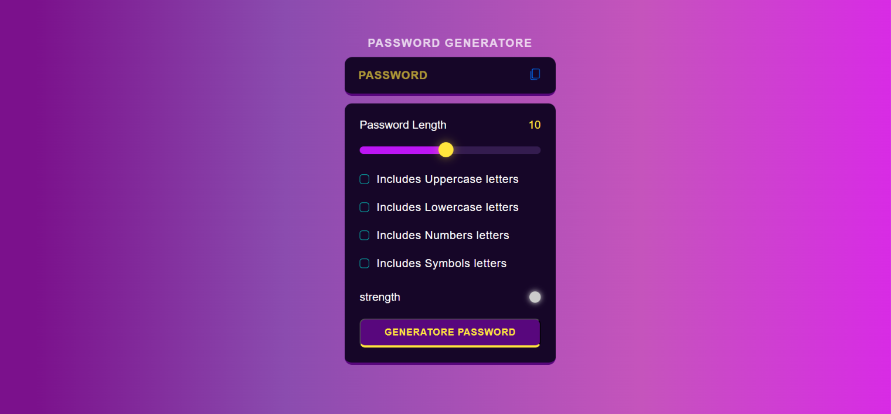

# 🔐 Password Generator

A simple and responsive Password Generator built using HTML, CSS, and JavaScript. This application helps users generate strong and secure passwords with customizable options.

## 🚀 Live Demo

https://yadavsawan4062-hub.github.io/PasswordGenerator/

## 📸 Screenshot



## ✨ Features

* Generate secure random passwords
* Adjustable password length using a slider
* Include Uppercase Letters
* Include Lowercase Letters
* Include Numbers
* Include Symbols
* Password Strength Indicator
* Copy Password to Clipboard

## 🛠️ Technologies Used

* HTML5
* CSS3
* JavaScript (Vanilla JS)

## 📂 Project Structure

PasswordGenerator/

├── index.html

├── style.css

├── script.js

└── assets/

  └── copy.png

## 💻 How to Run Locally

1. Clone the repository

```bash
git clone https://github.com/yadavsawan4062-hub/PasswordGenerator.git
```

2. Open the project folder

```bash
cd PasswordGenerator
```

3. Open `index.html` in your browser

## 👨‍💻 Author

**Sawan Yadav**

GitHub: https://github.com/yadavsawan4062-hub
